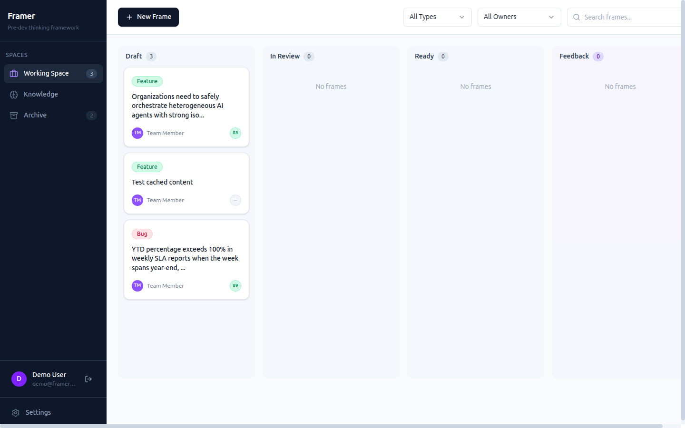
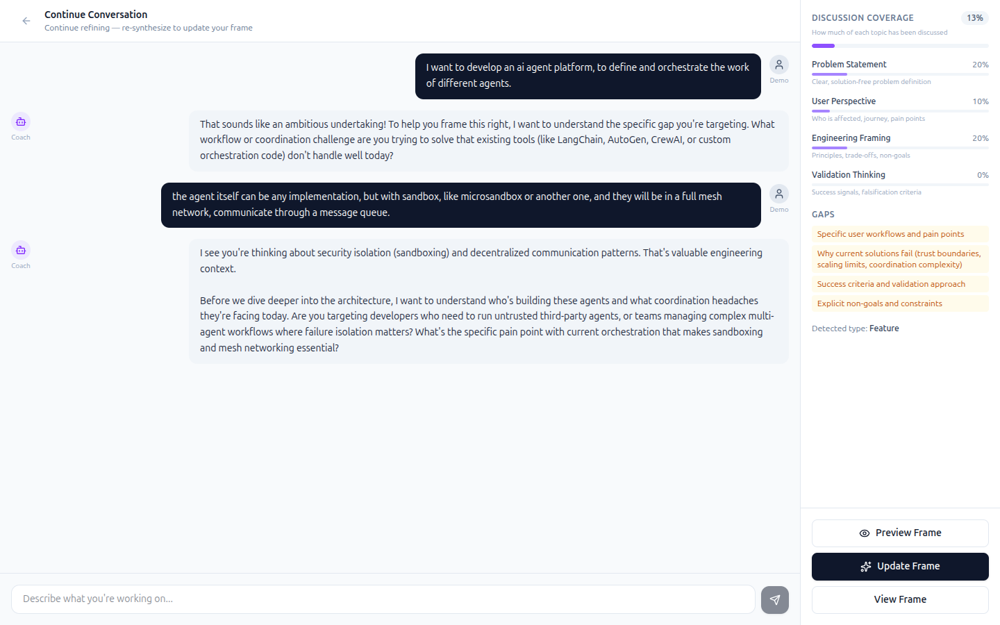
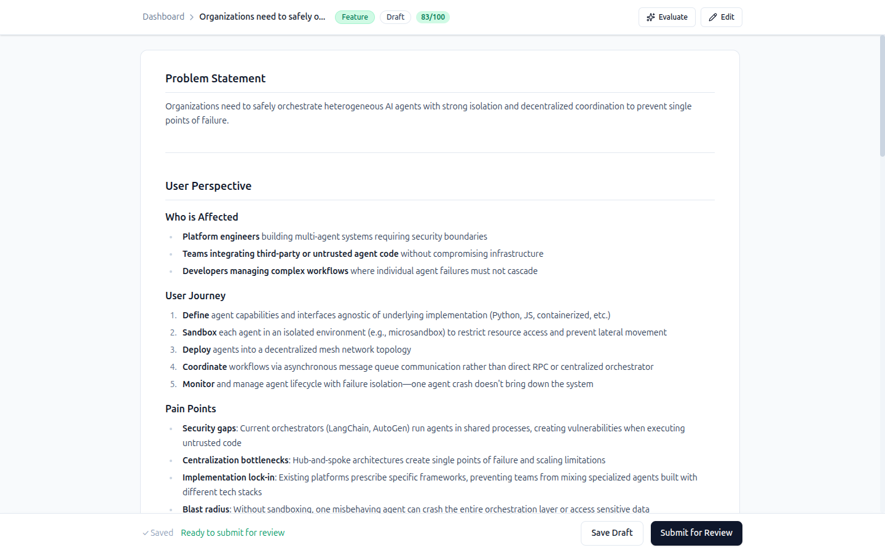
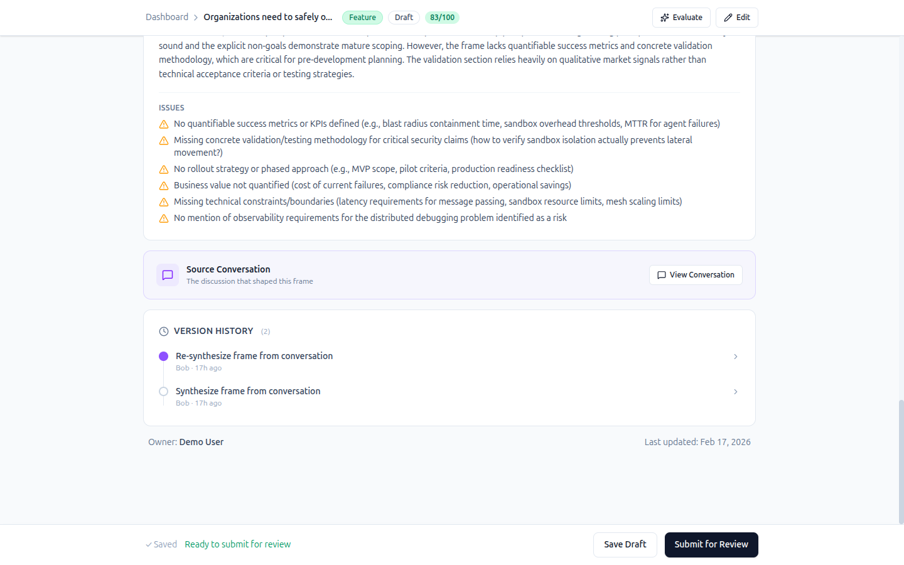
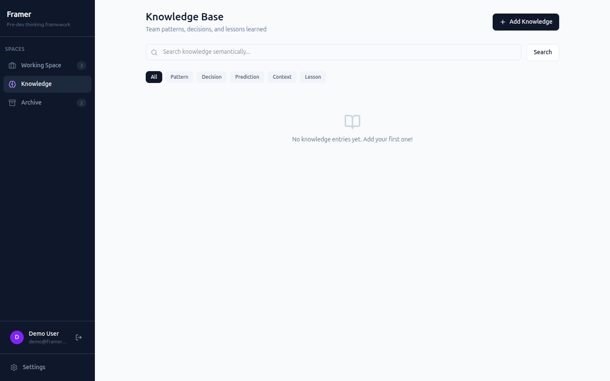
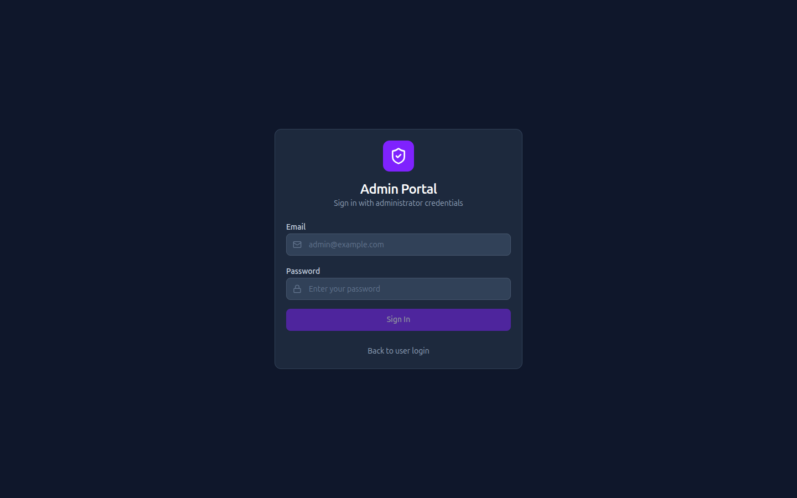

# Framer

**AI-Assisted Pre-Development Thinking Framework**

Framer is a structured thinking tool that helps engineering teams frame problems before writing code. It combines a conversation-first workflow with AI coaching to ensure thorough problem understanding, user perspective consideration, and validation planning.



## Why Framer?

Before jumping into code, developers often miss crucial context:
- **Who** is affected by this problem?
- **What** are we explicitly *not* doing?
- **How** will we know if we succeeded?

Framer provides a structured framework to capture this thinking through natural conversation with an AI coach, then synthesizes it into a well-organized frame document.

## Key Features

### Conversation-First Frame Creation

Start by describing your problem in plain language. The AI Coach guides you through structured thinking, tracking discussion coverage across four key dimensions in real time.



The right sidebar shows **Discussion Coverage** — how much of each section has been explored — along with identified gaps. When ready, preview the synthesized frame before committing.

### Structured Frame Documents

Each frame captures four dimensions of pre-development thinking:

| Section | Purpose |
|---------|---------|
| **Problem Statement** | Clear, focused description of what needs solving |
| **User Perspective** | Who experiences this, their journey, and pain points |
| **Engineering Framing** | Technical principles, trade-offs, and explicit non-goals |
| **Validation Thinking** | Success signals and disconfirming evidence |



### AI-Powered Quality Assessment

Frames are automatically evaluated by AI for completeness and quality. The evaluation provides a score breakdown per section, written feedback, and specific issues to address.



### Kanban Workflow

Visual status tracking with drag-and-drop across stages:

**Draft** → **In Review** → **Ready** → **Feedback** → **Archived**

Filter by frame type (Feature, Bug, Exploration) or owner. Each card shows the AI quality score at a glance.

### Knowledge Base

A team-wide knowledge system for patterns, decisions, and lessons learned. Supports semantic search via vector embeddings and manual categorization.



Categories: **Pattern** | **Decision** | **Prediction** | **Context** | **Lesson**

### Frame Preview

Preview what a synthesized frame will look like before committing. If no new messages have been sent since the last preview, the cached content is reused — no redundant AI calls.

### Version History

Git-backed change tracking with full diff support. Every synthesis and edit creates a commit, so you can trace how a frame evolved over time.

### Admin Portal

Separate admin interface for system configuration, user management, and AI provider settings.



## Architecture

```
┌─────────────────────────────────────────────────────────────┐
│                    Frontend (Next.js)                        │
│  React 19 + Zustand + Tailwind CSS v4 + Radix UI           │
├─────────────────────────────────────────────────────────────┤
│                    Backend (FastAPI)                         │
│  REST API + AI Agents + File Storage + ChromaDB Vectors     │
├─────────────────────────────────────────────────────────────┤
│                   PocketBase (Auth)                          │
│  User Authentication + Session Management                   │
└─────────────────────────────────────────────────────────────┘
```

### Backend Services
- **FrameService**: CRUD operations with file-based storage (YAML/JSON/Markdown)
- **ConversationService**: Conversation history and state management
- **KnowledgeService**: Knowledge entry persistence and retrieval
- **VectorService**: Semantic search via ChromaDB (default: all-MiniLM-L6-v2 embeddings)
- **GitService**: Automatic version control with diff support
- **IndexService**: SQLite cache for fast queries

### AI Agents
- **ConversationAgent**: Guides users through structured problem framing via chat
- **EvaluatorAgent**: Scores frames and provides detailed quality feedback
- **GeneratorAgent**: Creates content from questionnaire answers
- **RefinerAgent**: Improves content through conversation

AI providers are configurable — supports **Anthropic**, **OpenAI**, and any **OpenAI-compatible** endpoint (MiniMax, GLM, local models, etc.).

## Getting Started

### Prerequisites
- Docker & Docker Compose (recommended)
- Or: Python 3.12+ and Node.js 20+

### Quick Start with Docker

```bash
# Clone the repository
git clone https://github.com/ethannortharc/framer.git
cd framer

# Start all services
docker compose up -d

# Or use the helper script for specific environments
./scripts/docker.sh dev up      # Development
./scripts/docker.sh qa up       # QA/Staging
./scripts/docker.sh prod up     # Production
```

Services:
- Frontend: http://localhost:3000
- Backend API: http://localhost:8000
- PocketBase Admin: http://localhost:8090/_/

### Local Development

```bash
# Install dependencies
make install

# Start development servers
make dev
```

Or start each service individually:

```bash
# Terminal 1: Backend
cd src/backend
uvicorn app.main:get_app --reload --port 8000

# Terminal 2: Frontend
cd src/frontend
npm run dev
```

## Configuration

### Environment Variables

Configuration files are stored in `config/` directory:
- `.env.common` — Shared settings across all environments
- `.env.dev` — Development (ports 3000, 8000, 8090)
- `.env.qa` — QA/Staging (ports 3001, 8001, 8091)
- `.env.prod` — Production (ports 80, 8000, 8090)

### AI Configuration

```env
AI_PROVIDER=anthropic          # anthropic | openai | minimax | glm
AI_API_KEY=your-api-key
AI_MODEL=claude-sonnet-4-20250514
AI_TEMPERATURE=0.7
AI_MAX_TOKENS=4096
AI_TIMEOUT=300
```

### Embedding Configuration

```env
EMBEDDING_PROVIDER=default     # default (all-MiniLM-L6-v2) | openai (text-embedding-3-small)
```

## Project Structure

```
framer/
├── src/
│   ├── backend/              # FastAPI backend
│   │   └── app/
│   │       ├── api/          # REST endpoints (frames, conversations, knowledge, ai, admin)
│   │       ├── agents/       # AI agents (conversation, evaluator, generator, refiner)
│   │       ├── auth/         # PocketBase authentication
│   │       ├── models/       # Pydantic data models
│   │       └── services/     # Business logic (frame, conversation, knowledge, git, vector)
│   │
│   └── frontend/             # Next.js frontend
│       └── src/
│           ├── app/          # App router (dashboard, new, frame/[id], knowledge, admin, archive)
│           ├── components/   # React components (ui, layout, dashboard, frame, conversation)
│           ├── contexts/     # React contexts (AuthContext)
│           ├── lib/          # API client, auth, transforms
│           ├── store/        # Zustand state management
│           └── types/        # TypeScript types
│
├── config/                   # Environment configuration (.env.dev, .env.qa, .env.prod)
├── data/templates/           # Frame templates (bug-fix, feature, exploration)
├── docs/screenshots/         # Application screenshots
├── pocketbase/               # PocketBase migrations
├── scripts/                  # Helper scripts (docker.sh)
├── tests/                    # Backend tests (pytest)
├── docker-compose.yml
└── Makefile
```

## API Reference

### Frames API

| Method | Endpoint | Description |
|--------|----------|-------------|
| GET | `/api/frames` | List frames (filterable by status, owner, project) |
| POST | `/api/frames` | Create a frame |
| GET | `/api/frames/{id}` | Get frame by ID |
| PUT | `/api/frames/{id}` | Update frame content |
| PATCH | `/api/frames/{id}/status` | Update frame status |
| DELETE | `/api/frames/{id}` | Delete a frame |
| GET | `/api/frames/{id}/history` | Get version history with diffs |
| POST | `/api/frames/{id}/ai/evaluate` | AI quality evaluation |

### Conversations API

| Method | Endpoint | Description |
|--------|----------|-------------|
| POST | `/api/conversations` | Start a new conversation |
| GET | `/api/conversations` | List conversations |
| GET | `/api/conversations/{id}` | Get conversation by ID |
| POST | `/api/conversations/{id}/message` | Send a message |
| POST | `/api/conversations/{id}/preview` | Preview synthesized frame (no persist) |
| POST | `/api/conversations/{id}/synthesize` | Synthesize and create/update frame |
| DELETE | `/api/conversations/{id}` | Delete a conversation |

### Knowledge API

| Method | Endpoint | Description |
|--------|----------|-------------|
| POST | `/api/knowledge` | Create a knowledge entry |
| GET | `/api/knowledge` | List entries (filterable) |
| POST | `/api/knowledge/search` | Semantic vector search |
| POST | `/api/knowledge/distill` | AI-extract knowledge from conversations |

### AI API

| Method | Endpoint | Description |
|--------|----------|-------------|
| POST | `/api/ai/evaluate` | Evaluate frame quality |
| POST | `/api/ai/generate` | Generate content from answers |
| POST | `/api/ai/chat` | Chat for content refinement |

## Testing

```bash
# Run all backend tests
make test-backend

# Or directly
python -m pytest tests/backend/ -v

# E2E tests (Playwright)
cd src/frontend && npm run test:e2e
```

## Tech Stack

**Frontend**: Next.js 16, React 19, TypeScript, Zustand, Tailwind CSS v4, Radix UI, Playwright

**Backend**: Python 3.12, FastAPI, Pydantic v2, GitPython, ChromaDB, SQLite

**Infrastructure**: Docker & Docker Compose, PocketBase (auth)

**AI**: Anthropic Claude, OpenAI GPT, or any OpenAI-compatible provider

## License

MIT

## Contributing

1. Fork the repository
2. Create a feature branch
3. Make your changes with tests
4. Run `make test` to verify
5. Submit a pull request

---

Built with the belief that better thinking leads to better code.
